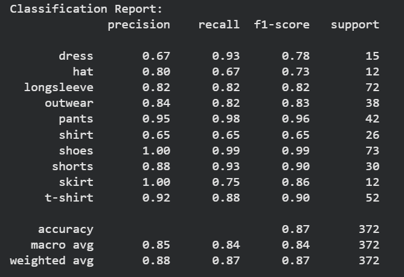
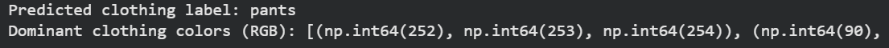
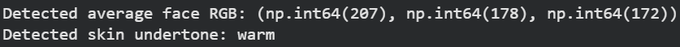

# MoodCloset 👗✨

An AI-powered personalized fashion recommendation system that combines computer vision, clothing classification, color analysis, skin-undertone detection, and mood-based personalization to generate more relevant outfit recommendations.

## Project Overview

MoodCloset explores how artificial intelligence can be used to create a more personalized fashion recommendation experience.

Instead of recommending clothing based only on general fashion categories, the system considers multiple factors including:

- Clothing type
- Dominant clothing colors
- Skin undertone
- User mood
- Personalized styling preferences

The project combines computer vision and AI techniques into a complete recommendation pipeline, from analyzing clothing images to generating personalized fashion suggestions.

---

## How MoodCloset Works

The system follows a multi-stage AI pipeline:

1. Receive and process clothing/user input
2. Classify the clothing category
3. Extract dominant clothing colors
4. Analyze the user's skin undertone
5. Incorporate mood information
6. Combine the extracted information
7. Generate personalized outfit recommendations

---

## Clothing Classification

The clothing classifier recognizes categories including:

- Dress
- Hat
- Long sleeve
- Outerwear
- Pants
- Shirt
- Shoes
- Shorts
- Skirt
- T-shirt

The final classification evaluation achieved approximately **87% accuracy** across 372 test samples.

---

## Color Analysis

MoodCloset analyzes the dominant colors present in clothing images.

The extracted color information can then be incorporated into the recommendation process to help generate outfits that better match the user's characteristics and styling context.

---

## Skin Undertone Detection

The system also analyzes facial color information to estimate the user's skin undertone.

This information provides another personalization factor that can be considered when recommending clothing colors and outfit combinations.

---

## Personalized Recommendation Approach

MoodCloset brings multiple AI components together rather than relying on a single prediction.

The recommendation process considers:

**Clothing Classification + Color Analysis + Skin Undertone + Mood → Personalized Fashion Recommendation**

This approach was designed to make recommendations more context-aware and personalized to the individual user.

---
## Demo 🎥

A complete demonstration of the MoodCloset system is available in this repository.

▶️ [View MoodCloset Demo](demo/moodcloset_demo.mp4)

The demo shows the project workflow and how the different components work together to produce the final experience.

---

## Tools & Technologies

### AI & Computer Vision
- Computer Vision
- Image Classification
- MobileNetV2
- Transfer Learning
- K-Means Clustering
- Color Analysis

### Programming & Data
- Python
- NumPy
- Pandas

### AI Libraries
- TensorFlow
- Keras
- scikit-learn

### Development
- Jupyter Notebook
- Google Colab
- GitHub

---

## Repository Structure

- `notebooks/` — MoodCloset AI pipeline and implementation
- `docs/` — Project report, paper, and supporting documentation
- `results/` — Classification, color-analysis, and skin-undertone results
- `demo/` — Full MoodCloset project demonstration
- `.gitignore` — Git ignore configuration
- `README.md` — Project documentation

---

## Key Features

- Clothing image classification
- Dominant color extraction
- Skin-undertone analysis
- Mood-based personalization
- Personalized fashion recommendations
- Computer vision-based clothing analysis
- Integrated AI recommendation pipeline

---

## Skills Demonstrated

This project demonstrates experience in:

- Artificial Intelligence
- Computer Vision
- Transfer Learning
- Image Classification
- Image Processing
- Color Analysis
- K-Means Clustering
- Personalized Recommendation Systems
- AI Pipeline Development
- Model Evaluation
- Applied AI Development

---

## Documentation

Detailed project documentation is available in the [`docs`](docs/) directory.

The AI implementation and analysis are available in the [`notebooks`](notebooks/) directory.

---

## Project Context

MoodCloset was developed as an academic AI project at **Effat University**.

The project demonstrates how computer vision and multiple personalization factors can be integrated into an AI-powered fashion recommendation system.

---

## Academic Disclaimer

This project was developed for academic and educational purposes. The recommendations generated by the system are experimental and are not intended to represent professional fashion or styling advice.
